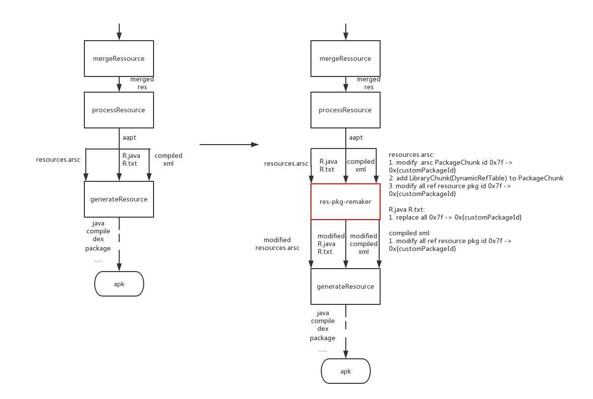

# res-pkg-remaker
a gradle plugin which can change your res packageId by simple config without modify aapt, very useful for plugin-framework and multi dynamic resource
# Download
root build.gradle (still unavailable, waiting link to jcenter)
```groovy
buildscript {
    repositories {
        jcenter()
    }
    dependencies {
        classpath 'com.seiginonakama:res-pkg-remaker:0.8.0'
    }
}
```
# Install
module build.gradle
```groovy
apply plugin: 'res-pkg-remaker'

remaker {
    enable = true // default true
    packageId = 0x55 //from [0x02 - 0x7f]
}
```
# Principle



why add LibraryChunk(DynamicRefTable) ? because android 5.0+ don't recognize customPackageId when lookup resource id,
but we can provide a map(packageName -> customPackageId) by provide LibraryChunk, so android 5.0+ can find it.

License
-------
     Copyright (C) 2017 seiginonakama (https://github.com/seiginonakama).

     Licensed under the Apache License, Version 2.0 (the "License");
     you may not use this file except in compliance with the License.
     You may obtain a copy of the License at
    
        http://www.apache.org/licenses/LICENSE-2.0
    
     Unless required by applicable law or agreed to in writing, software
     distributed under the License is distributed on an "AS IS" BASIS,
     WITHOUT WARRANTIES OR CONDITIONS OF ANY KIND, either express or implied.
     See the License for the specific language governing permissions and
     limitations under the License.